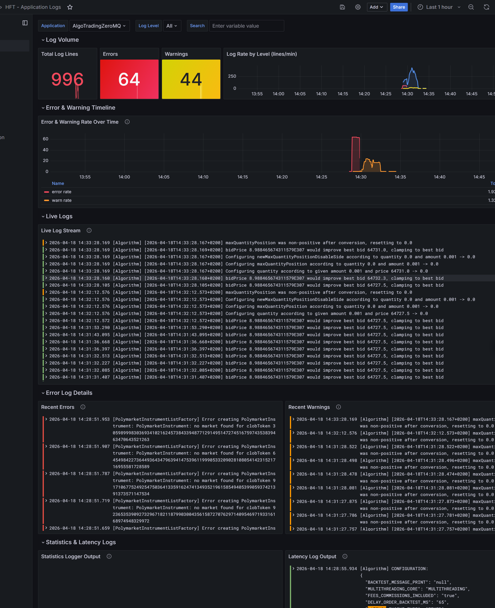
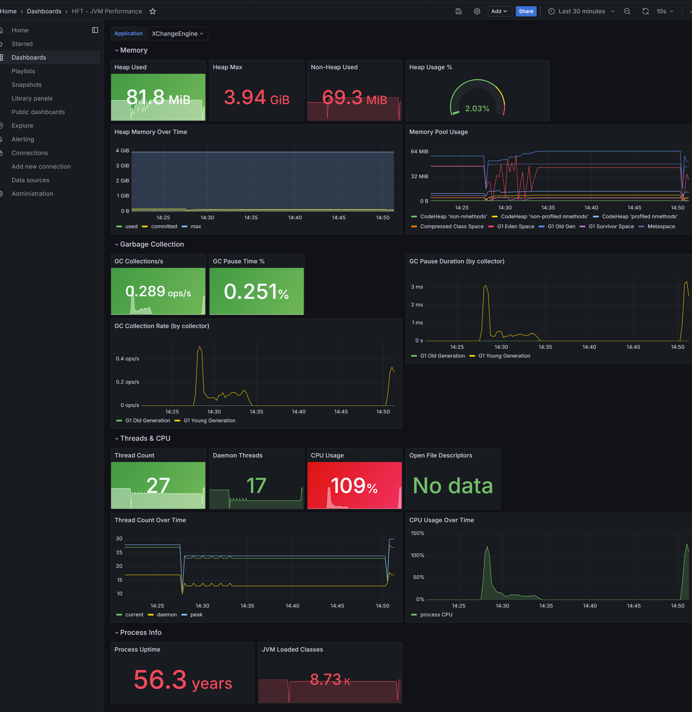
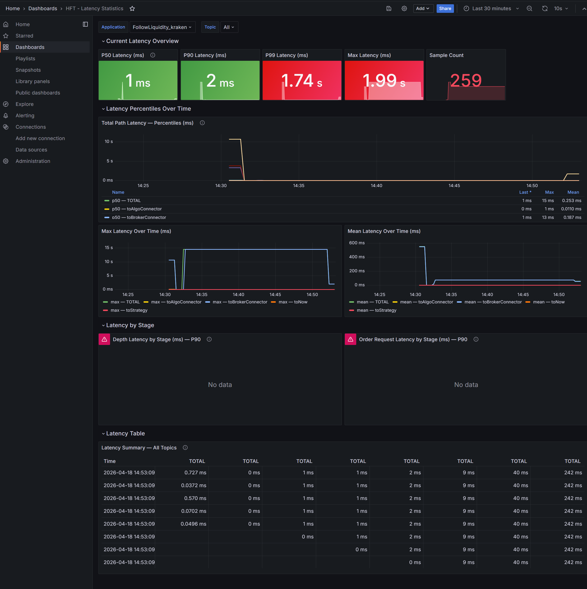

# Monitoring

The HFT Framework includes a set of **Grafana dashboards** for real-time observability of running algorithms,
JVM performance, latency, and execution quality. The dashboards are powered by a log/metrics pipeline and
are organised by concern.

The full monitoring stack lives in the [`monitoring/`](../../monitoring/) folder and is started with a single
script — no manual Grafana or Prometheus configuration needed.

---

## Stack Components

| Component       | Port   | Role                                                                         |
|-----------------|--------|------------------------------------------------------------------------------|
| **Grafana**     | `3000` | Dashboards and visualisation                                                 |
| **Loki**        | `3100` | Log aggregation (receives logs from `LokiLogAppender`)                       |
| **Prometheus**  | `9090` | Metrics storage (scrapes Pushgateway)                                        |
| **Pushgateway** | `9091` | Prometheus push endpoint (receives metrics from `PrometheusMetricsExporter`) |
| **Promtail**    | —      | Optional: file-based log shipping                                            |

---

## Quick Start

### 1. Start the monitoring stack

Navigate to the `monitoring/` directory and run the appropriate start script for your OS.
The scripts automatically check for Docker, start it if needed, and bring up all containers.

**Windows (PowerShell):**

```powershell
cd monitoring
.\start.ps1
```

**Windows (CMD):**

```cmd
cd monitoring
start.cmd
```

**Linux / macOS:**

```bash
cd monitoring
./start.sh
```

After a few seconds the following URLs become available:

| Service     | URL                   | Credentials       |
|-------------|-----------------------|-------------------|
| Grafana     | http://localhost:3000 | `admin` / `admin` |
| Prometheus  | http://localhost:9090 | —                 |
| Loki        | http://localhost:3100 | —                 |
| Pushgateway | http://localhost:9091 | —                 |

### 2. Stop the monitoring stack

**Windows (PowerShell):**

```powershell
.\stop.ps1
```

**Windows (CMD):**

```cmd
stop.cmd
```

**Linux / macOS:**

```bash
./stop.sh
```

---

## Configuring the Java Application

The Java application publishes **logs to Loki** and **JVM metrics to Prometheus Pushgateway** through two
components — `LokiLogAppender` and `PrometheusMetricsExporter` — both configured via environment variables
or JVM system properties.

### Environment Variables

Set these before launching any engine or `AlgoTradingZeroMq` JAR:

| Variable          | Default              | Description                                              |
|-------------------|----------------------|----------------------------------------------------------|
| `LOKI_HOST`       | `localhost`          | Hostname/IP of the Loki server                           |
| `LOKI_PORT`       | *(empty — disabled)* | Loki HTTP port. Set to `3100` to enable log shipping     |
| `PROMETHEUS_HOST` | `localhost`          | Hostname/IP of the Prometheus Pushgateway                |
| `PROMETHEUS_PORT` | *(empty — disabled)* | Pushgateway port. Set to `9091` to enable metrics push   |
| `APP_NAME`        | `hft-framework`      | Application label attached to every log entry and metric |

> **Both integrations are disabled by default** — they activate only when their respective `*_PORT` variable
> is set. This means the application starts and runs normally without any monitoring stack.

### JVM System Property Overrides

All variables can alternatively be set as JVM system properties:

| JVM property             | Equivalent env var |
|--------------------------|--------------------|
| `-Dloki.host=…`          | `LOKI_HOST`        |
| `-Dloki.port=3100`       | `LOKI_PORT`        |
| `-Dprometheus.host=…`    | `PROMETHEUS_HOST`  |
| `-Dprometheus.port=9091` | `PROMETHEUS_PORT`  |
| `-Dlog.appName=my-app`   | `APP_NAME`         |

### Typical Launch Command

```bash
java \
  -DLOKI_HOST=localhost -DLOKI_PORT=3100 \
  -DPROMETHEUS_HOST=localhost -DPROMETHEUS_PORT=9091 \
  -DAPP_NAME=AlgoTradingZeroMq \
  -jar AlgoTradingZeroMq.jar parameters_constant_spread.json
```

Or via environment variables:

```bash
# Linux / macOS
export LOKI_HOST=localhost
export LOKI_PORT=3100
export PROMETHEUS_HOST=localhost
export PROMETHEUS_PORT=9091
export APP_NAME=AlgoTradingZeroMq
java -jar AlgoTradingZeroMq.jar parameters_constant_spread.json
```

```powershell
# Windows PowerShell
$env:LOKI_HOST="localhost"
$env:LOKI_PORT="3100"
$env:PROMETHEUS_HOST="localhost"
$env:PROMETHEUS_PORT="9091"
$env:APP_NAME="AlgoTradingZeroMq"
java -jar AlgoTradingZeroMq.jar parameters_constant_spread.json
```

---

## How It Works

### Log Shipping — `LokiLogAppender`

`LokiLogAppender` is a Log4j2 appender that batches log events and POSTs them to Loki's push API
(`/loki/api/v1/push`) every second or when 100 events accumulate, whichever comes first.

- Logs are grouped into separate Loki **streams** per log level (`INFO`, `WARN`, `ERROR`, …), so that
  Grafana/LogQL can filter by the `level` stream label without scanning log content.
- Each entry carries an `app` stream label (set from `APP_NAME`) to allow filtering by application.
- The appender is registered automatically on startup when `LOKI_PORT` is set; it is a no-op otherwise.
- If Loki is unreachable at startup the appender is silently disabled — logging to file still works.

### JVM Metrics — `PrometheusMetricsExporter`

`PrometheusMetricsExporter` is a singleton that pushes Prometheus metrics to the Pushgateway every **15 s**.

- JVM / process metrics (heap, GC, threads, CPU time, file descriptors) are exported automatically via
  the `simpleclient_hotspot` default exports.
- Metrics are pushed under the job name equal to `APP_NAME`, making it easy to select a specific process
  in Grafana by filtering on the `job` label.
- If the Pushgateway is unreachable at startup the exporter is silently disabled.

### Prometheus Scrape Configuration

Prometheus is pre-configured in [`monitoring/prometheus/prometheus.yml`](../../monitoring/prometheus/prometheus.yml)
to scrape the Pushgateway on `pushgateway:9091`. No changes are needed for the default setup.

To point Prometheus at a Pushgateway running on a **different host or port**, edit the `targets` entry:

```yaml
scrape_configs:
  - job_name: "pushgateway"
    honor_labels: true
    static_configs:
      - targets:
          - "my-host:9091"
```

Reload Prometheus after saving: `curl -X POST http://localhost:9090/-/reload`

### Loki Configuration

Loki is pre-configured in [`monitoring/loki/loki-config.yml`](../../monitoring/loki/loki-config.yml) with
local filesystem storage. No changes are needed for the default setup. Data is persisted in the
`hft_loki_data` Docker volume.

---

## Dashboard Overview

All dashboards are pre-provisioned and load automatically in Grafana.

### HFT - Application Logs

Provides a full view of structured application logs emitted by any running component (e.g. `AlgoTradingZeroMQ`).

Key panels:
- **Total Log Lines / Errors / Warnings** — aggregate counters for the current time window
- **Log Rate by Level** — lines/min chart split by log level
- **Error & Warning Timeline** — rate-over-time chart for errors and warnings
- **Live Log Stream** — real-time scrollable log output
- **Error Log Details / Recent Warnings** — last N error and warning entries side by side
- **Statistics & Latency Logs** — raw output of the statistics and latency loggers



---

### HFT - JVM Performance

Tracks JVM internals for any running engine (e.g. `XChangeEngine`).

Key panels:
- **Memory** — Heap Used / Heap Max / Non-Heap Used / Heap Usage %
- **Heap Memory Over Time** — used, committed, max
- **Memory Pool Usage** — per-pool breakdown (Eden, Old Gen, Survivor, Metaspace, Code Heap…)
- **Garbage Collection** — GC Collections/s, GC Pause Time %, GC Pause Duration and Collection Rate by collector
- **Threads & CPU** — Thread Count, Daemon Threads, CPU Usage %, CPU Usage Over Time, Thread Count Over Time
- **Process Info** — Process Uptime, JVM Loaded Classes



---

### HFT - Latency Statistics

Detailed end-to-end latency breakdown, filterable by application and topic.

Key panels:
- **Current Latency Overview** — P50 / P90 / P99 / Max latency stat cards + Sample Count
- **Latency Percentiles Over Time** — total path latency percentiles (p50 TOTAL, p50 toAlgoConnector, p50
  toBrokerConnector)
- **Max Latency Over Time** — max TOTAL, toAlgoConnector, toBrokerConnector, toNow, toStrategy
- **Mean Latency Over Time** — same dimensions as max chart
- **Latency by Stage** — Depth Latency by Stage (P90) and Order Request Latency by Stage (P90)
- **Latency Summary Table** — all topics with full percentile columns per timestamp



---

#### Latency Stage Definitions

Every message tracked by the latency system carries a chain of timestamps set at well-defined
handoff points. The latency **stages** measure the time elapsed *between consecutive handoffs*.

##### Inbound messages — `depth`, `trade`, `executionReport`

These messages originate outside the application and travel *inward* toward the strategy:

```
Exchange / Broker  →  BrokerConnector  →  AlgoConnector  →  Strategy  →  (now)
     timestamp            toBrokerConnector  toAlgoConnector  toStrategy   toNow
```

| Stage                   | Metric name                                                                                   | What it measures                                                                                                                                                                                                                                                 |
|-------------------------|-----------------------------------------------------------------------------------------------|------------------------------------------------------------------------------------------------------------------------------------------------------------------------------------------------------------------------------------------------------------------|
| Origin timestamp        | *(baseline)*                                                                                  | For **depth** and **trade**: the exchange-side event time.<br>For **executionReport**: when the order status was created/changed on the broker side.                                                                                                             |
| **`toBrokerConnector`** | `depth.toBrokerConnector`<br>`trade.toBrokerConnector`<br>`executionReport.toBrokerConnector` | Time from the origin timestamp until the BrokerConnector (e.g. `AbstractMarketDataConnectorPublisher` or `AbstractBrokerTradingEngine`) stamped the message just before publishing it internally. Captures exchange-to-connector network and processing latency. |
| **`toAlgoConnector`**   | `depth.toAlgoConnector`<br>`trade.toAlgoConnector`<br>`executionReport.toAlgoConnector`       | Time from the BrokerConnector stamp until the AlgoConnector (e.g. `ZeroMqMarketDataConnector` or `AbstractTradingEngineConnector`) received and de-serialised the message. Captures ZeroMQ transport and deserialization latency.                                |
| **`toStrategy`**        | `depth.toStrategy`<br>`trade.toStrategy`<br>`executionReport.toStrategy`                      | Time from the AlgoConnector stamp until the strategy callback ran (e.g. `Algorithm.onDepthUpdate`, `Algorithm.onTradeUpdate`, `Algorithm.onExecutionReportUpdate`). Captures internal dispatch and queue latency.                                                |
| **`toNow`**             | `depth.toNow`<br>`trade.toNow`<br>`executionReport.toNow`                                     | Time from the last recorded stamp (strategy, or the latest available stage) until the latency statistics are collected. Captures any remaining processing time or measurement overhead still pending at collection time.                                         |
| **`TOTAL`**             | `depth.TOTAL`<br>`trade.TOTAL`<br>`executionReport.TOTAL`                                     | Sum of all stages above — end-to-end elapsed time from the origin timestamp to *now*.                                                                                                                                                                            |

##### Outbound messages — `orderRequest`

Order requests originate *inside* the strategy and travel *outward* toward the broker/exchange:

```
Strategy creates order  →  AlgoConnector  →  BrokerConnector  →  (now / market)
  timestampCreation          toAlgoConnector   toBrokerConnector      toNow
```

| Stage                   | Metric name                      | What it measures                                                                                                                                                                                 |
|-------------------------|----------------------------------|--------------------------------------------------------------------------------------------------------------------------------------------------------------------------------------------------|
| Origin timestamp        | *(baseline)*                     | When the strategy created and submitted the `OrderRequest`.                                                                                                                                      |
| **`toAlgoConnector`**   | `orderRequest.toAlgoConnector`   | Time from strategy creation until the AlgoConnector picked up and forwarded the order. Captures internal dispatch latency.                                                                       |
| **`toBrokerConnector`** | `orderRequest.toBrokerConnector` | Time from the AlgoConnector stamp until the BrokerConnector (e.g. ZeroMQ or IB gateway) received the order and was about to send it to the exchange. Captures ZeroMQ transport latency outbound. |
| **`toNow`**             | `orderRequest.toNow`             | Time from the BrokerConnector stamp until the latency statistics are collected — residual overhead and wire-send time.                                                                           |
| **`TOTAL`**             | `orderRequest.TOTAL`             | Full round-trip from strategy order creation to the moment it is recorded by the statistics collector.                                                                                           |

> **Tip:** High `toBrokerConnector` on inbound messages usually points to network/broker latency.
> High `toAlgoConnector` on inbound messages usually points to ZeroMQ transport or deserialization bottlenecks.
> High `toStrategy` on inbound messages indicates internal queue or thread-scheduling delays.
> High `toAlgoConnector` on `orderRequest` indicates internal dispatch delays before the order leaves the process.

---

### HFT - Algorithm Custom Columns

Custom per-algorithm metrics defined by each strategy (user-defined columns logged by the algorithm).
Contents depend on the active algorithm.

---

### HFT - Algorithm Trades & Execution

Visualises trade activity and execution report flow for a running algorithm.

---

### HFT - Algorithm Portfolio PnL

Tracks portfolio-level Profit & Loss over time for a running algorithm.

---

### HFT - Throughput Statistics

Reports message throughput across the ZeroMQ connectors and internal queues.

---

## Dashboard List

| Dashboard                          | Description                                        |
|------------------------------------|----------------------------------------------------|
| HFT - Application Logs             | Structured log viewer with error/warning timeline  |
| HFT - Algorithm Custom Columns     | Per-algorithm custom metric columns                |
| HFT - JVM Performance              | Heap, GC, threads, CPU for any engine process      |
| HFT - Algorithm Trades & Execution | Trade and execution report activity                |
| HFT - Algorithm Portfolio PnL      | Portfolio PnL over time                            |
| HFT - Throughput Statistics        | ZeroMQ / internal queue throughput                 |
| HFT - Latency Statistics           | End-to-end latency percentiles and stage breakdown |

---

## Troubleshooting

| Symptom                       | Likely cause                                          | Fix                                                                  |
|-------------------------------|-------------------------------------------------------|----------------------------------------------------------------------|
| No logs appear in Grafana     | `LOKI_PORT` not set, or Loki not running              | Set `LOKI_PORT=3100` and ensure `start.ps1` / `start.sh` was run     |
| No JVM metrics in Grafana     | `PROMETHEUS_PORT` not set, or Pushgateway not running | Set `PROMETHEUS_PORT=9091` and confirm Pushgateway is up             |
| Log appender disabled warning | Loki not reachable at app startup                     | Start the monitoring stack *before* starting the Java app            |
| Dashboards show "No data"     | Wrong `Application` variable value                    | Set the dashboard's `Application` drop-down to match `APP_NAME`      |
| Docker daemon not running     | Docker Desktop not started                            | Run `start.ps1` — it detects and starts Docker Desktop automatically |
